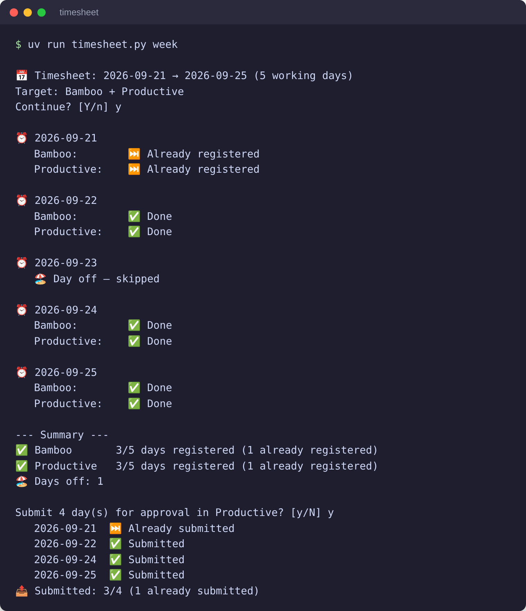
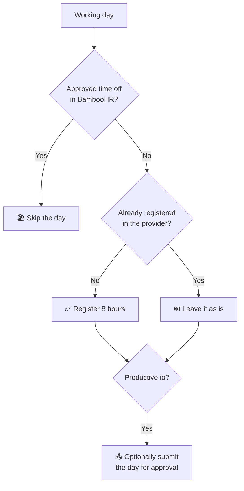
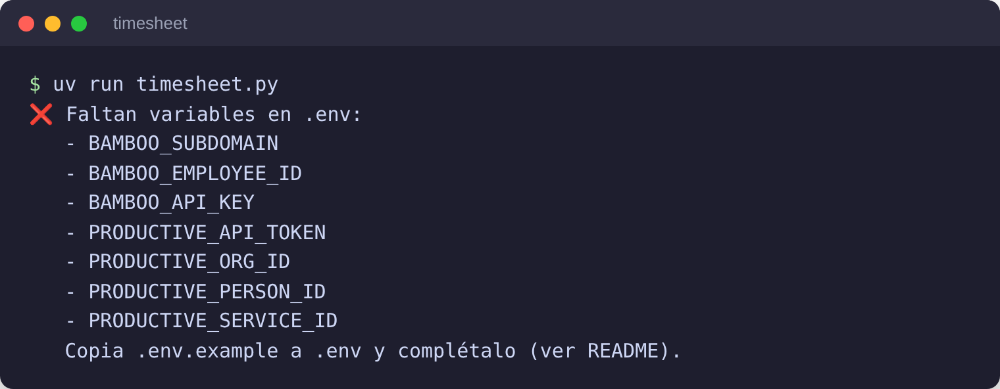

# Timesheet Automation

A small Python CLI that fills in your timesheet in **BambooHR** and/or **Productive.io** for you: 8 hours per working day, skipping days off and days already registered.



## Contents

1. [What it does](#what-it-does)
2. [Quick start (5 steps)](#quick-start-5-steps)
3. [Getting your credentials](#getting-your-credentials)
4. [Usage](#usage)
5. [Troubleshooting](#troubleshooting)
6. [Development](#development)
7. [Changelog and contributing](#changelog-and-contributing)
8. [License](#license)

## What it does

For every working day (Monday–Friday) in the period you choose:



- **BambooHR:** two clock entries, 08:00–13:00 and 14:00–17:00.
- **Productive.io:** one 480-minute time entry. If a 0-minute entry already exists for that day, it is updated instead of creating a duplicate.
- At the end, it asks whether to **submit the Productive.io days for approval** (default: no).

> **Note:** BambooHR credentials are always required, even with `--productive`, because days off are read from BambooHR.

## Quick start (5 steps)

### 1. Install the prerequisites

- **Python 3.13+**
- **[uv](https://docs.astral.sh/uv/getting-started/installation/)** (Python package manager):

  ```bash
  # macOS / Linux
  curl -LsSf https://astral.sh/uv/install.sh | sh
  ```

### 2. Download the project

```bash
git clone https://github.com/rsotor/timesheet.git
cd timesheet
```

### 3. Install dependencies

```bash
uv sync
```

### 4. Create your configuration file

```bash
cp .env.example .env
```

Open `.env` in any text editor and replace every `xxxx` with your own values (see [Getting your credentials](#getting-your-credentials)). The file is listed in `.gitignore`, so it never gets committed.

| Variable | Needed for | Where to find it |
|---|---|---|
| `BAMBOO_SUBDOMAIN` | Always | The part before `.bamboohr.com` in your BambooHR URL |
| `BAMBOO_EMPLOYEE_ID` | Always | Your BambooHR profile URL |
| `BAMBOO_API_KEY` | Always | BambooHR → your name → **API Keys** |
| `PRODUCTIVE_API_TOKEN` | Productive.io | **Settings → API integrations** |
| `PRODUCTIVE_ORG_ID` | Productive.io | Your Productive.io URL |
| `PRODUCTIVE_PERSON_ID` | Productive.io | API call (see below) |
| `PRODUCTIVE_SERVICE_ID` | Productive.io | API call (see below) |

### 5. Run it

```bash
uv run timesheet.py
```

The script shows the period and the destination, and asks for confirmation before writing anything. That's it.

If something is missing or wrong in `.env`, it stops before making any request and tells you what to fix:



## Getting your credentials

### BambooHR

**Subdomain:** if you open BambooHR at `https://acme.bamboohr.com`, your subdomain is `acme`.

**Employee ID:** open your profile; the number at the end of the URL is your ID:

```
https://acme.bamboohr.com/employees/employee.php?id=1234
                                                    ^^^^
```

**API key:**

1. Log in to BambooHR.
2. Click your name (top right) → **API Keys**.
3. Create a new key, give it a name (e.g. `timesheet`) and copy the key into `.env`.

> The key is shown only once. If you lose it, delete it and generate a new one.

### Productive.io

**API token and organization ID:**

1. Go to **Settings → API integrations**.
2. Click **Generate new token** and copy the token into `PRODUCTIVE_API_TOKEN`.
3. The **organization ID** is the number at the start of the path in your Productive.io URL (`https://app.productive.io/12345-acme/...` → `12345`). Copy it into `PRODUCTIVE_ORG_ID`.

**Person ID** (your user ID) — replace the token, organization ID and email:

```bash
curl -H "X-Auth-Token: YOUR_TOKEN" \
     -H "X-Organization-Id: YOUR_ORG_ID" \
     "https://api.productive.io/api/v2/people?filter[email]=you@example.com"
```

Copy the `"id"` of the first element in `data`.

**Service ID** (the service where you log your hours). The simplest way is to log one time entry manually in Productive.io first, then run:

```bash
curl -H "X-Auth-Token: YOUR_TOKEN" \
     -H "X-Organization-Id: YOUR_ORG_ID" \
     "https://api.productive.io/api/v2/time_entries?filter[person_id]=YOUR_PERSON_ID&page[size]=1"
```

In the response, look for `relationships` → `service` → `data` → `id`.

## Usage

```bash
uv run timesheet.py [period] [--bamboo | --productive | --both] [-y]
```

### Period

| Argument | Range registered |
|---|---|
| *(none)*, `today`, `daily` | Today |
| `week`, `weekly` | Monday of the current week → today |
| `month`, `monthly` | 1st of the current month → today |
| `last-month` | The whole previous month |
| `22` | 1st of the current month → day 22 |
| `01-03-2025 31-03-2025` | Explicit range (`DD-MM-YYYY DD-MM-YYYY`) |

### Options

| Flag | Effect |
|---|---|
| `--bamboo` | BambooHR only |
| `--productive` | Productive.io only |
| `--both` | Both providers (default) |
| `-y`, `--yes` | Skip the initial confirmation |

### Examples

```bash
# Today, both providers
uv run timesheet.py

# The whole current week, without the confirmation prompt
uv run timesheet.py week -y

# From the 1st to the 15th of this month, BambooHR only
uv run timesheet.py 15 --bamboo

# The previous month, Productive.io only
uv run timesheet.py last-month --productive

# A custom range
uv run timesheet.py 01-03-2025 31-03-2025
```

Running the same period twice is safe: days already registered are reported as `⏭️ Already registered` and left untouched.

## Troubleshooting

| Symptom | Likely cause |
|---|---|
| `❌ Invalid configuration in .env` | `.env` does not exist, has empty or example (`xxxx`) values, or a value has the wrong format (IDs must be numbers). Each line says which variable and why. Repeat [step 4](#4-create-your-configuration-file). |
| `❌ Error` on every day for BambooHR | Wrong `BAMBOO_SUBDOMAIN`, employee ID or API key, or your account cannot use time tracking. |
| `❌ Error` on every day for Productive.io | Wrong token, organization ID, person ID or service ID. |
| Days off are not skipped | The time-off request is not approved yet in BambooHR. |
| `uv: command not found` | uv is not installed, or the terminal needs to be restarted after installing it. |

## Development

```bash
uv sync --extra dev
uv run pytest -v
```

The tests mock every HTTP call; they never touch the real APIs.

```
timesheet/
├── timesheet.py          # CLI entry point
├── timesheet/
│   ├── common.py         # Argument parsing, working days, config check
│   ├── bamboo.py         # BambooHR: is_off_day, has_entries, clock_day
│   └── productive.py     # Productive.io: has_entries, clock_day, submit_day
├── tests/                # pytest suite (HTTP mocked)
├── docs/images/          # README screenshots
├── .env.example          # Configuration template
├── LICENSE
└── pyproject.toml
```

## Changelog and contributing

- What changed in each version: [CHANGELOG.md](CHANGELOG.md)
- How to contribute: [CONTRIBUTING.md](CONTRIBUTING.md)
- Security issues: [SECURITY.md](SECURITY.md) (never in a public issue)

## License

[MIT](LICENSE)
